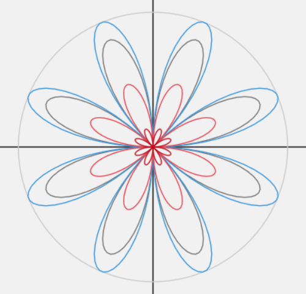
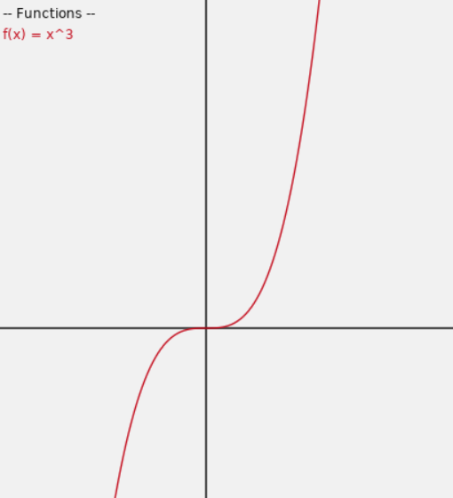
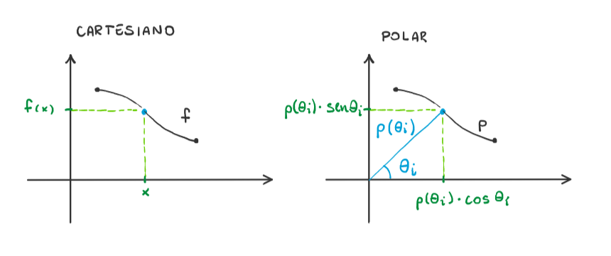
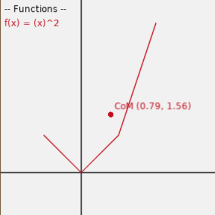
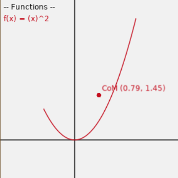
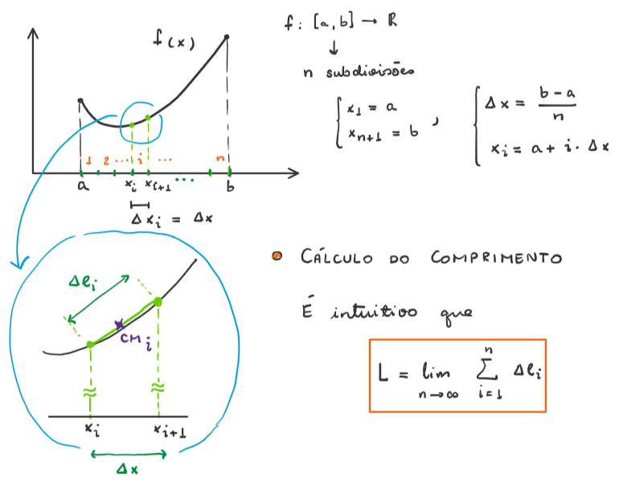
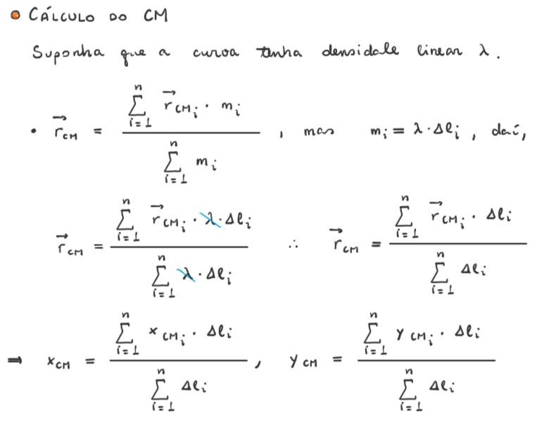
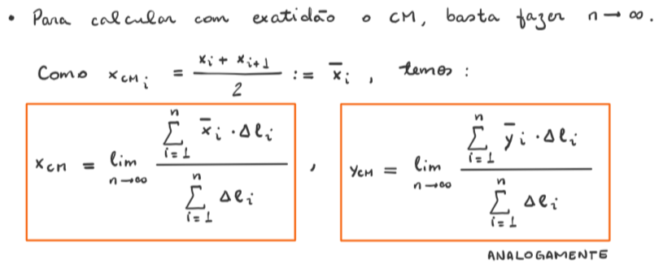
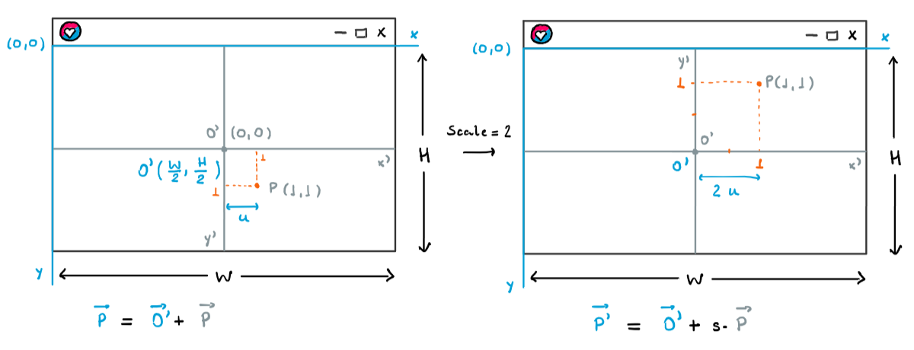

<link rel="stylesheet" href="./my-style.css">

<div class="capa">

<div class="title">

# Gráficos em Lua
#### Tiago Vargas Pereira de Oliveira

</div>



****

</div>

# Sumário

- Sumário
- Introdução
- Teoria e Implementação
	- Funções
	- Plotagem
	- Centro de Massa
	- Translação e Zoom
- Aplicação
	- Arquivo `main.lua`
	- Arquivo `Function.lua`
	- Arquivo `Editor.lua`
	- Arquivo `Colors.lua`
- Referências


# Introdução

Esse documento discute um programa de computador de plotagem de gráficos, bem como um pouco da teoria utilizada para criá-lo.

O programa é capaz de:
- Plotar gráficos em coordenadas cartesianas e polares
- Mostrar o centro de massa de uma curva plotada

A linguagem escolhida foi Lua, usando LÖVE como framework e ambiente de execução.

A manipulação de funções é feitas pela linha de comando.

Boa parte do código fonte é legível (desde que saiba inglês). Trechos interessantes ou mais complicados serão discutidos.


# Teoria e Implementação

## Funções

Funções são criadas e editadas pela linha de comando, mais precisamente, pelo console de debug. Para acessar o console, pressione `Ctrl` + `enter`. Para sair do console, digite `cont`.

Funções foram implementadas como um objeto (na verdade, o nome correto é _tabela_). Uma função possui:
- Um nome
- Uma expressão
- Um domínio
- Um gráfico
- Um modo, que diz se ela deve ser desenhada no plano cartesiano ou polar
- Uma visibilidade
- Uma cor

Uma função possui outros atributos, mas não foram listados porque são usados apenas internamente.

É possível modificar qualquer um desses atributos pelo console, mas você só precisa se preocupar com o nome, a expressão e o modo da função. Se um domínio não for explicitamente definido, o domínio padrão será utilizado.

Funções são manipuladas internamente pelo `Editor`. A maior parte da interação com o `Editor` se dá pelo console.

Definidos nome, expressão e domínio de uma função, o programa se encarrega de plotar seu gráfico e marcar seu centro de massa no plano.

<div class="exemplo">

> **Exemplo**
>
> Criando uma função
>
> ```
> lua_debug> f = Editor.NewFunction("f", "x^3")
> lua_debug> f.domain = Editor.NewDomain(-2, 2, 100)
> lua_debug> cont
> ```
>
> 

</div>


## Plotagem

Dados um domínio e uma função `f`, a plotagem é feita marcando no plano todos os pares ordenados `(x, f(x))` – no modo cartesiano, ou `( f(x)*cos(x), f(x)*sin(x) )` no modo polar – com `x` assumindo todos os valores no domínio.



Os pares ordenados são definidos assim, pois para LÖVE desenhar uma figura, devemos indicar sua posição – em pixels – na janela, o que podemos interpretar como as coordenadas do plano cartesiano da janela. Detalhes serão discutidos mais adiante.

O programa exige um conjunto discreto para o domínio. Podemos gerar um domínio passando ao programa os dois valores que o delimita, bem como o número de subdivisões.

No modo cartesiano, o programa marca no plano todos os pontos `(x, f(x))`, os conectando por segmentos de reta. Esta será a representação do gráfico de `f`. O análogo acontece no modo polar.

Como consequência, funções reais contínuas não podem ser exatamente plotadas, mas podemos gerar uma figura suficientemente fiel à esperada, desde que forneçamos um número suficientemente grande de subdivisões.

<div class="exemplo">

> **Exemplo**
>
> Gráfico de `f(x) = x^2`, para `x` em `[-1, 2]` com `n = 3` subdivisões.
>
> 

> **Exemplo**
>
> A mesma função, para `x` em `[-1, 2]` com `n = 150` subdivisões.
>
> 

</div>


## Centro de Massa

Para calcular o centro de massa de uma curva, assumimos antes que a curva tem densidade linear uniforme.

Como um gráfico foi implementado como uma sequência de segmentos de reta, basta considerar que cada segmento tem uma massa, e calcular as contribuições de cada.







<!-- MOSTRAR IMAGEM EXPLICATIVA -->


## Translação e Zoom

Caso não seja possível ver um gráfico por completo, podemos "arrastar" o plano para os lados, os diminuir o zoom.

As setas do teclado movimentam a origem. Como as figuras são desenhadas com base na origem do editor, o efeito é de o plano ser arrastado para os lados. Inicialmente, a origem se encontra no centro da janela.

As teclas de `+` e de `-` controlam o zoom, o aumentando ou o diminuindo, respectivamente. Isso é implementado multiplicando todos os pontos dos gráficos por uma constante `Scale` referente ao grau de ampliação. Por exemplo, quando `Scale` vale `1`, cada pixel na tela representa uma unidade no plano. Como as figuras seriam muito pequenas nessa escala, seu valor padrão é `50` (uma unidade dista 50 pixels). Imagine a ampliação como um transformação linear que apenas "estica" ou "encolhe" os vetores unitários `i` e `j`.

#### Interessante

Todas as figuras são originalmente posicionadas com base na origem da janela. Para contornar isso, foi criada uma outra origem, que inicialmente se encontra no centro da janela. Assim, para desenhar qualquer figura, apenas mudamos o referencial, i.e. somando as coordenadas da origem em relação à janela. A escala já trata de inverter a orientação do eixo `y`.



``` lua
-- Na definição da multiplicação de um gráfico por um escalar
for i = 1, #graph do
	new_graph[i] =
	{
		x = graph[i].x *  scalar,
		y = graph[i].y * -scalar
	}
end
```

``` lua
-- Mudando das coordenadas em relação à janela, para em
-- relação à nova origem
transformed_graph = (f.graph * Editor.Scale) + Editor.Origin
```


# Aplicação

O código fonte é composto pelos seguintes arquivos:
- `main.lua`
	- É o ponto de entrada do programa.

- `Function.lua`
	- Descreve as funções criadas como objetos.

- `Editor.lua`
	- Administra as funções e mostra informações na tela.

- `Colors.lua`
	- Apenas descreve as cores que serão usadas no programa.

Por padrão, variáveis em Lua são globais. Para serem locais, devemos declará-las com `local`. Para podermos usar uma variável pelo console, ela deve ser global.


## Arquivo `main.lua`

Em Lua, `apelido = require("Modulo")` equivale à `import Modulo as apelido` em Python.

Foi criado uma tabela de valores-padrão, que será usada para inicializar o `Editor`.

A função `love.load` é chamada apenas uma vez, quando o programa inicia.

Em seguida, as funções `love.update` e `love.draw` são chamadas alternadamente – cerca de 60 vezes por segundo – até o programa ser fechado. Elas servem para atualizar o cenário e desenhá-lo em seguida. A cada ciclo, o programa vai computar todos os gráficos, centros de massa (_CoM_), administrar movimentos da origem e zoom; e desenhar as informações (_HUD_), eixos, gráficos e centros de massa.

`love.keypressed(key)` é executada a qualquer momento sempre que uma tecla `key` é pressionada. Ali, apertar `0` restaura o zoom padrão, `Ctlr` + `M` alterna o modo e `Ctrl` + `enter` abre o console.

Repare como `Editor` e `Colors` sao globais. Isso nos permite funções da "classe" `Editor` e as cores de `Colors` pelo console.

<div class="code-break">

``` lua
Editor   = require("Editor")
Colors   = require("Colors")

PI = math.pi

local Defaults =
{
	Mode       = "cartesian",
	Color      = Colors.Black,
	Background = Colors.White,
	Scale      = 50,
}

function love.load(args)
	Editor.Initialize(Defaults)
end
```

</div>

``` lua
function love.update(dt)
	Editor.ComputeAllGraphs()
	Editor.ComputeAllCOMs()

	Editor.ManageOriginPanning()
	Editor.ManageZoom()
end

function love.draw()
	Editor.DrawHud()
	Editor.DrawAxes()

	Editor.PlotAllGraphs()
	Editor.PlotAllCOMs()
end

function love.keypressed(key)
	local is_ctrl_down = love.keyboard.isDown("rctrl", "lctrl")

	if key == "return" and is_ctrl_down then
		debug.debug()
	end

	if key == "m" and is_ctrl_down then
		Editor.ChangeMode()
	end

	if key == "kp0" or key == "0" then
		Editor.Scale = Defaults.Scale
	end
end
```


## Arquivo `Function.lua`

Funções matemáticas em Lua estão dentro da tabela global `math`. Para não precisar escrever `math.sin`, `math.tan` etc, a função `treat_expression` converte `sin` em `math.sin` etc, que será usado internamente. `pretty_exp` representa a expressão sem `math.`, `math_exp` representa a expressão completa, i.e. com `math.`.

A função `evaluate` computa o valor de uma expressão matemática a partir de uma _string_. Equivale a `eval` em Python.

Lua permite redefinir operadores para tabelas (similar a objetos em Python). Isso foi mostrado em `transformed_graph = (f.graph * Editor.Scale) + Editor.Origin` (foram redefinidos os operadores `+` e `*`). Isso é feito com metatabelas. A função `setmetatable` redefine esses novos operadores para uma tabela.

A função `computeCOM` expressa os somatórios descritos em "Centro de Massa".

<div class="code-break">

``` lua
local Function = {}

-----------------------------------------------
--[[ Auxiliary functions                   ]]--
-----------------------------------------------

local function distance(P, Q)
	local dx = P.x - Q.x
	local dy = P.y - Q.y

	return math.sqrt( dx ^ 2 + dy ^ 2 )
end

local function evaluate(expression)
	return load("return " .. expression)()
end

local function treat_expression(pretty_exp)
	local math_exp

	math_exp = pretty_exp:gsub("sin",  "math.sin")
	math_exp = math_exp:gsub("cos",  "math.cos")
	math_exp = math_exp:gsub("tan",  "math.tan")
	math_exp = math_exp:gsub("sqrt", "math.sqrt")
	math_exp = math_exp:gsub("abs",  "math.abs")
	math_exp = math_exp:gsub("exp",  "math.exp")
	math_exp = math_exp:gsub("ln",   "math.log")
	math_exp = math_exp:gsub("log",  "math.log10")
	math_exp = math_exp:gsub("pow",  "math.pow")
	math_exp = math_exp:gsub("PI",   "math.pi")

	return math_exp
end
```

</div>

<div class="code-break">

``` lua
local function is_number(n)
	if n ~= 1/0 and n ~= -1/0 and n == n and n ~= nil then
		return true
	end

	return false
end

local function apply_to_self(self, value)
	local exp = self.mathExp:gsub("x", value)
	return evaluate(exp)
end

local function translate_graph(graph, vector)
	local new_graph = {}

	for i = 1, #graph do
		new_graph[i] =
		{
			x = graph[i].x + vector.x,
			y = graph[i].y + vector.y
		}
	end
	return new_graph
end

local function scale_graph(graph, factor)
	local new_graph = {}
	setmetatable(new_graph, { __add = translate_graph })

	for i = 1, #graph do
		new_graph[i] =
		{
			x = graph[i].x *  factor,
			y = graph[i].y * -factor
		}
	end
	return new_graph
end

```

</div>

<div class="code-break">

``` lua
-----------------------------------------------
--[[ Class Methods                         ]]--
-----------------------------------------------

Function.New = function (pretty_exp, mode)
	local o  = {}
	setmetatable(o, { __index = Function,
	                  __call = apply_to_self })

	o.prettyExp = pretty_exp  or "x"
	o.mode      = mode or "cartesian"
	o.mathExp   = treat_expression(pretty_exp)

	return o
end


-----------------------------------------------
--[[ Object Methods                        ]]--
-----------------------------------------------

Function.computeCartesianGraph = function (self)
	for i, xi in pairs(self.domain) do
		local P = { x = xi, y = self(xi) }
		self.graph[i] = P
	end
end

Function.computePolarGraph = function (self)
	for _, theta in pairs(self.domain) do
		local ro = self(theta)
		local P  = { x = ro*math.cos(theta),
		             y = ro*math.sin(theta) }
		table.insert(self.graph, P)
	end
end

Function.computeGraph = function (self)
	self.graph = {}
	setmetatable(self.graph, { __mul = scale_graph })

```

</div>

``` lua
	if self.mode == "cartesian" then
		self:computeCartesianGraph()
	elseif self.mode == "polar" then
		self:computePolarGraph()
	end
end

Function.computeCOM = function (self)
	local Sxdl, Sydl, L = 0, 0, 0
	local graph = self.graph
	local n     = #graph - 1

	for i = 1, n do
		local P = graph[i]
		local Q = graph[i + 1]
		if is_number(P.y) and is_number(Q.y) then
			local dLi = distance(P, Q)
			local xmi = (P.x + Q.x) / 2
			local ymi = (P.y + Q.y) / 2

			L    = L + dLi
			Sxdl = Sxdl + (xmi * dLi)
			Sydl = Sydl + (ymi * dLi)
		end
	end

	self.com = { x = Sxdl/L, y = Sydl/L }
end

return Function
```


## Arquivo `Editor.lua`

`FunctionColors` define quais as cores que as funções podem assumir (para não correr o risco de terem a cor branca ou difíceis de ver). `GetextColor` cuida das funções terem cores diferentes.

`unpack_graph` foi definida apenas para podermos usar `love.graphics.line`, em `Plot`.

<div class="code-break">

``` lua
local Function = require("Function")
local Colors   = require("Colors")
```

</div>

<div class="code-break">

``` lua
local Editor = {}

FunctionColors =
{
	Colors.Red,
	Colors.Green,
	Colors.Yellow,
	Colors.Blue,
	Colors.Purple,
	Colors.Cyan,
	Colors.Grey,
	Colors.BrightRed,
	Colors.BrightGreen,
	Colors.BrightBlue,
	Colors.BrightPurple,
}
local ColorIndex = 0

local function GetNextColor()
	ColorIndex  = ColorIndex + 1

	if ColorIndex > #FunctionColors then
		ColorIndex = 1
	end
	return FunctionColors[ColorIndex]
end

local Functions = {}
local Width, Height


-----------------------------------------------
--[[ Auxiliary Functions                   ]]--
-----------------------------------------------

--- Returns a table of points `(x, y)` as a sequence
--- `{ x1, y1, x2, y2, ... }`
---
---@param graph table # Table of ordered pairs
---
local function unpack_graph(graph)
	local coordinates_sequence = {}

```

</div>

<div class="code-break">

``` lua
	for i = 1, #graph do
		local ordered_pair = graph[i]
		table.insert(coordinates_sequence, ordered_pair.x)
		table.insert(coordinates_sequence, ordered_pair.y)
	end

	return coordinates_sequence
end


-----------------------------------------------
--[[ Class Methods                         ]]--
-----------------------------------------------

Editor.Initialize = function (defaults)
	love.graphics.setColor(defaults.Color)
	love.graphics.setBackgroundColor(defaults.Background)
	Width, Height = love.graphics.getDimensions()

	Editor.Color      = defaults.Color
	Editor.Background = defaults.Background
	Editor.Mode       = defaults.Mode
	Editor.Scale      = defaults.Scale
	Editor.Origin     = { x = Width/2, y = Height/2 }
	Editor.Domain     = Editor.NewDomain(-50, 50, 2000)
end

Editor.NewDomain = function (a, b, subdivisions)
	local domain = {}
	local dx = (b - a) / subdivisions

	for x = a, b, dx do
		table.insert(domain, x)
	end

	return domain
end

--- Creates a new instance of `Function`
---
---@param pretty_exp string # Expression without `"math."`
---@param mode?      string # `"cartesian"` | `"polar"`
---
Editor.NewFunction = function (name, pretty_exp, mode)
```

</div>

<div class="code-break">

``` lua
	local o = Function.New(pretty_exp, mode)
	Functions[name] = o

	o.name      = name
	o.isVisible = true
	o.domain    = Editor.Domain
	o.color     = GetNextColor()

	return o
end

Editor.RemoveFunction = function (name)
	Functions[name] = nil
end

Editor.ComputeAllGraphs = function ()
	for _, f in pairs(Functions) do
		if f.mode == Editor.Mode then
			f:computeGraph()
		end
	end
end

Editor.ComputeAllCOMs = function ()
	for _, f in pairs(Functions) do
		if f.mode == Editor.Mode then
			f:computeCOM()
		end
	end
end

local Font = love.graphics.getFont()
local Margin = 5

local function WriteNameInList(f, i)
	local text = string.format("%s(x) = %s",
	                           f.name, f.prettyExp)
	local name_y_pos = (Font:getHeight() + Margin) * i
	love.graphics.print(text, Margin, Margin + name_y_pos)
end

local function ListFunctionNames()
	local index = 0
	for _, f in pairs(Functions) do
```

</div>

<div class="code-break">

``` lua
		if f.isVisible then
			love.graphics.setColor(f.color)
		else
			love.graphics.setColor(Colors.BrightGrey)
		end

		if f.mode == Editor.Mode then
			index = index + 1
			WriteNameInList(f, index)
		end
	end

	love.graphics.setColor(Editor.Color)
end

Editor.DrawHud = function ()
	love.graphics.setColor(Editor.Color)

	love.graphics.print("-- Functions --", Margin, Margin)
	ListFunctionNames()

	local bottom = Height - Margin - Font:getHeight()
	local right  = Width  - Margin - 100
	love.graphics.print("Scale: " .. Editor.Scale,
	                                       Margin, bottom)
	love.graphics.print("Mode: "  .. Editor.Mode,
	                                       right,  bottom)
end

Editor.DrawAxes = function ()
	local O = Editor.Origin
	love.graphics.line(0, O.y,  Width,  O.y) -- Ox
	love.graphics.line(O.x, 0,  O.x, Height) -- Oy
end

local function Plot(f)
	love.graphics.setColor(f.color)

	local transformed_graph = (f.graph * Editor.Scale)
	                                        + Editor.Origin
	love.graphics.line(unpack_graph(transformed_graph))
end

```

</div>

<div class="code-break">

``` lua
Editor.PlotAllGraphs = function ()
	for _, f in pairs(Functions) do
		if f.mode == Editor.Mode and f.isVisible then
			Plot(f)
		end
	end
end

local point_radius = 4

local function PlotCOM(f)
	love.graphics.setColor(f.color)

	local com_x_pos = (f.com.x *  Editor.Scale)
	                                    + Editor.Origin.x
	local com_y_pos = (f.com.y * -Editor.Scale)
	                                    + Editor.Origin.y
	love.graphics.circle("fill", com_x_pos, com_y_pos,
	                                        point_radius)

	local text_x_pos = com_x_pos + Margin
	local text_y_pos = com_y_pos - Margin - Font:getHeight()
	local text = string.format("CoM (%.2f, %.2f)",
	                                 f.com.x, f.com.y)
	love.graphics.print(text, text_x_pos, text_y_pos)
end

Editor.PlotAllCOMs = function ()
	for _, f in pairs(Functions) do
		if f.mode == Editor.Mode and f.isVisible then
			PlotCOM(f)
		end
	end
end

local key = love.keyboard

Editor.ManageOriginPanning = function ()
	local delta = 4

	if     key.isDown("up")   then
		Editor.Origin.y = Editor.Origin.y + delta
	elseif key.isDown("down") then
		Editor.Origin.y = Editor.Origin.y - delta
```

</div>

<div class="code-break">

``` lua
	end
	if     key.isDown("left")  then
		Editor.Origin.x = Editor.Origin.x + delta
	elseif key.isDown("right") then
		Editor.Origin.x = Editor.Origin.x - delta
	end
end

Editor.ManageZoom = function ()
	local delta = 2

	local zoom_in_pressed  = key.isDown("=", "kp+")
	local zoom_out_pressed = key.isDown("-", "kp-")

	if     zoom_in_pressed  then
		Editor.Scale = Editor.Scale + delta
	elseif zoom_out_pressed then
		Editor.Scale = Editor.Scale - delta
	end

	if Editor.Scale < 1 then
		Editor.Scale = 1
	end
end

Editor.ChangeMode = function ()
	if     Editor.Mode == "polar" then
		Editor.Mode = "cartesian"
	elseif Editor.Mode == "cartesian" then
		Editor.Mode = "polar"
	end
end

return Editor
```


## Arquivo `Colors.lua`

``` lua
local Colors = {}

Colors.White      = { 242, 242, 242 }
Colors.Black      = {  12,  12,  12 }
Colors.Red        = { 197,  15,  31 }
```

</div>

<div class="code-break">

``` lua
Colors.Green      = {  19, 161,  14 }
Colors.Yellow     = { 193, 156,   0 }
Colors.Blue       = {   0,  55, 218 }
Colors.Purple     = { 136,  23,  52 }
Colors.Cyan       = {  58, 150, 221 }
Colors.Grey       = { 118, 118, 118 }

Colors.BrightGrey   = { 204, 204, 204 }
Colors.BrightRed    = { 231,  72,  86 }
Colors.BrightGreen  = {  22, 198,  12 }
Colors.BrightBlue   = {  59, 120, 255 }
Colors.BrightPurple = { 180,   0, 158 }

-- Remember that `LOVE` uses colors from 0..1 instead
-- of 0..255
for _, value in pairs(Colors) do
	for i = 1, 3 do
		value[i] = value[i] / 256
	end
end

return Colors
```


# Referências

LÖVE
- [Página principal](URL "https://love2d.org/")
<!-- - [Documentação](URL "") -->

Lua
- [Página principal](URL "https://www.lua.org/")
- [Editor online](URL "https://www.lua.org/cgi-bin/demo")
- [Manual de referência](URL "https://www.lua.org/manual/5.1/")
